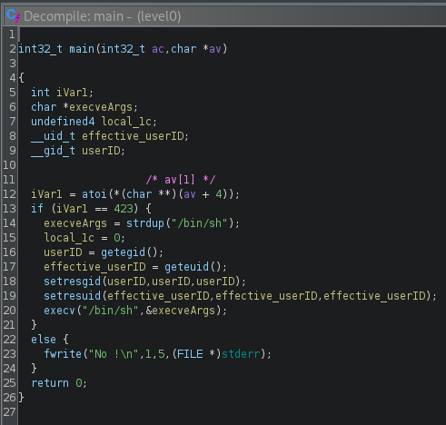

# Level 0
```
$ ls -l
total 8
-rwsr-s---+ 1 level1 users 5403 Mar  6  2016 level0
```
On ouvre le programme dans ghidra et dans la représentation en C, on comprend que ce programme appelle `atoi` sur le premier argument et le compare avec 423.
<br/>
Si la comparaison est bonne alors il exécute tous simplement `/bin/sh`. Et nous avons accès à l'utilisateur `level1` et récupérons son mot de passe dans `/home/user/level1/.pass`

